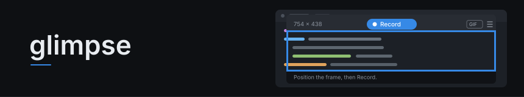
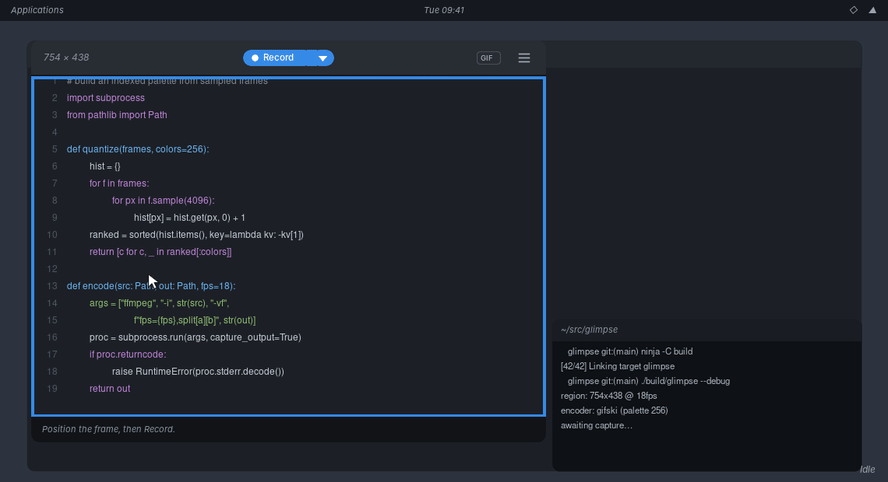

<div align="center">
  <picture>
    <source media="(prefers-color-scheme: dark)"  srcset="docs/assets/banner-dark.svg">
    <source media="(prefers-color-scheme: light)" srcset="docs/assets/banner-light.svg">
    
  </picture>
</div>

<br/>

<div align="center">

[](https://github.com/viniciusdc/glimpse/actions/workflows/check.yml)
[](docs/roadmap.md)
[](Cargo.toml)
[](https://gtk-rs.org)
[](LICENSE)
[](#building)

</div>

Simple screen recorder for a region of your screen, with an easy to use interface.

> The design was inspired by the now-deprecated
> [Peek](https://github.com/phw/peek), which got all the fundamentals right but
> unfortunately could not be maintained any longer. While looking for a
> replacement I found that none of the available tools were quite like what I
> liked about it, so I decided to build Glimpse — an independent implementation
> in Rust on GTK4 that solves a similar problem, and contains none of Peek's code.

## About

Glimpse makes it easy to create short screencasts of a screen area. You place the
Glimpse window over the part of the screen you want to record, press **Record**,
and get an animated GIF or an MP4. The hole in the middle of the window *is* the
recording area — it is transparent and clicks pass straight through it, so you can
keep using the application underneath while you line the frame up and while you
record.

<div align="center">
  
</div>

<p align="center">
  <sub>An illustration, not a screen capture — drawn by
  <a href="scripts/make-demo.py"><code>scripts/make-demo.py</code></a> and assembled with
  Glimpse's own encoding pipeline. See the FAQ for why it is not a real recording.</sub>
</p>

It was built for the cases where a screenshot is not enough and a real screencast
is too much: showing a UI interaction in a pull request, attaching a reproduction
to a bug report, or demonstrating a feature in a README.

Glimpse is **not** a general purpose screencast application. It records one region
of one screen, silently, to one file. There is no audio, no webcam, no editing, no
streaming, and no full-desktop or multi-monitor capture. If you need those, use
OBS.

Glimpse runs on **X11 only**. See the FAQ for why.

## Requirements

### Runtime

- An X11 session
- GTK4 >= 4.10
- FFmpeg >= 6 (developed against 6.1)

### Building

- Rust, stable
- `libgtk-4-dev` and `pkg-config`

## Installation

### From a release

```sh
curl -fsSL https://raw.githubusercontent.com/viniciusdc/glimpse/main/scripts/install.sh | sh
```

Read [the script](scripts/install.sh) first — it is short, and that advice holds
for anything piped into a shell. It downloads the release tarball, **verifies its
SHA-256 against the published checksum and refuses to install on a mismatch**,
extracts into a temporary directory and copies out only the binary, and installs
to `~/.local/bin` without ever calling sudo.

`GLIMPSE_VERSION=v0.1.0` pins a version rather than taking the latest, and
`INSTALL_DIR=/usr/local/bin` puts it elsewhere — somewhere you would then need
permission to write.

Releases are not signed. The checksum guards against a corrupted or tampered
download only as far as the checksum itself is trustworthy, and both come from the
same host, so a compromise of that host defeats both.

### From source

There are no distribution packages yet.

```sh
sudo apt install libgtk-4-dev ffmpeg     # or your distribution's equivalent
git clone https://github.com/viniciusdc/glimpse.git
cd glimpse
make install                             # into ~/.local, with a desktop entry
```

`make install PREFIX=/usr/local` installs system-wide, and `make uninstall`
removes it. `make check-reqs` reports anything missing before a build finds out.

To run it without installing:

```sh
cargo run
```

## Usage

1. Launch Glimpse. Move and resize the window until the hole covers what you want
   to record — drag the header to move it, drag any edge or corner to resize.
2. Pick **GIF** or **MP4** from the chip in the header.
3. Press **Record**. Press **Stop** when you are done. For a still image instead,
   choose **Snapshot** from the arrow beside the button — it saves a PNG
   immediately, with no start and stop.
4. The file is written to your videos folder as `glimpse.gif` or `glimpse.mp4`.
   An existing file is never overwritten — you get `glimpse-1.gif`, and so on.

Use the menu in the header to pick where recordings are saved, and to choose a
light, dark, or system-matching theme. Both are remembered.

The header shows the exact pixel size of the recording area, and a timer while
recording. The status line at the bottom tells you where the finished file went.

Frame rate and pointer capture are in the header menu too, alongside the output
folder and the theme. Everything is remembered.

## Frequently asked questions

[`docs/faq.md`](docs/faq.md) covers where recordings go, why a GIF is so large,
why a recording stopped by itself, whether a failed encode lost anything, what the
arrow next to Record does, and why there is no Wayland, macOS or Windows support.

## Contributing

Bug reports and pull requests are welcome.
[`CONTRIBUTING.md`](CONTRIBUTING.md) covers what a pull request has to clear;
[`docs/development.md`](docs/development.md) covers setting up.

```sh
make            # list every target
make check      # the gate: docs, formatting, clippy, tests
make headless   # run it on a private X server, off your screen
make smoke      # record → GIF and record → MP4, off your screen
```

Glimpse is a screen recorder, so testing it naturally means opening windows and
grabbing the display on the machine you are using. `make headless` and `make
smoke` run it against an `Xvfb` instead.

Decisions — including the ones that were reversed and why — are recorded in
[`docs/adr/`](docs/adr/).

## Project layout

<!-- BEGIN GENERATED layout (verified by scripts/sync-docs.sh; edit descriptions freely, paths are checked) -->
```
AGENTS.md               Working agreement — the failure modes already hit here
Makefile                make check is the gate; make selftest is the one CI can't run
src/
  lib.rs                Library surface, so the logic is testable without a display
  main.rs               The binary: application entry and shutdown ownership
  x11probe.rs           The X11 boundary — origin, root size, input-shape readback
  geometry.rs           WidgetRect → SurfaceRect → RootPixelRect, with clipping
  config.rs             Persisted settings: theme, format, output folder
  session.rs            The recording lifecycle: pure state machine, no I/O
  capture.rs            The ffmpeg recorder: owns the child, reaps on every path
  worker.rs             Runs the recorder off the UI thread; dropping it reaps
  encode.rs             GIF and MP4 encoding, and the atomic commit
  ui.rs                 The framing window: hole, input region, lock/unlock
examples/
  root_geometry.rs      Query X with no GTK window involved
  framing_window.rs     The smallest useful framing window
  record.rs             Record a fixed region, no GTK window involved
tests/
  geometry.rs           Clipping — the part of the chain testable without a display
  session.rs            Lifecycle policy: drift, retry, cancellation, shutdown
  capture.rs            ffmpeg arguments and workspace ownership
  config.rs             Defaults, round-trip, and surviving a corrupt file
  encode.rs             Collision policy, argument shape, real GIF and MP4 encodes
data/
  glimpse.desktop       Desktop entry, installed by `make install`
scripts/
  headless.sh           Runs Glimpse on a private X server, off your screen
  install.sh            Installs a release, refusing anything that fails its checksum
  make-demo.py          Draws the README animation, frame by frame
  sync-docs.sh          Regenerates the ADR index; fails the build on doc drift
docs/
  adr/                  Decision records, append-only
  faq.md                Using it: output, formats, aborted recordings, platforms
  assets/               README banner, light and dark
  architecture.md       The stack, the modules, the conversion chain
  development.md        Setting up, the gates, how to verify geometry changes
  roadmap.md            What comes next, in dependency order
```
<!-- END GENERATED layout -->

## Further reading

- [`docs/faq.md`](docs/faq.md) — using it: output locations, formats, why a recording aborted, platform support
- [`docs/architecture.md`](docs/architecture.md) — the stack, the conversion chain, the session lifecycle
- [`docs/development.md`](docs/development.md) — setting up, the gates, verifying geometry and click-through
- [`docs/roadmap.md`](docs/roadmap.md) — what is done, and what comes next in dependency order
- [`CONTRIBUTING.md`](CONTRIBUTING.md) — what a pull request has to clear
- [`AGENTS.md`](AGENTS.md) — working agreement for coding agents
- [`docs/adr/`](docs/adr/) — decision records:
<!-- BEGIN GENERATED adr-index (regenerate with `make docs-sync`) -->
  - [0000](docs/adr/0000-x11-framing-window-spike.md) — The X11 framing-window spike
  - [0001](docs/adr/0001-rust-and-gtk4.md) — Rust and GTK4 as the stack
  - [0002](docs/adr/0002-ffmpeg-pipeline-and-session-model.md) — An ffmpeg-only pipeline, and an explicit session model
  - [0003](docs/adr/0003-apache-2-0.md) — Apache-2.0, and what that requires of the capture implementation
  - [0004](docs/adr/0004-review-corrections-and-the-lifecycle-spine.md) — Review corrections, and a lifecycle spine before capture
  - [0005](docs/adr/0005-gif-encoding-and-the-atomic-commit.md) — GIF encoding, and how the output is committed
  - [0006](docs/adr/0006-the-header-is-the-chrome.md) — The header bar is the window chrome
  - [0007](docs/adr/0007-gif-and-mp4.md) — GIF and MP4 as the initial output formats
  - [0008](docs/adr/0008-settings-and-themes.md) — Settings, and what the theme is allowed to change
  - [0009](docs/adr/0009-snapshot.md) — Snapshot, and why it is not a one-frame recording
<!-- END GENERATED adr-index -->

## Licence

Apache-2.0 — see [LICENSE](LICENSE) and [NOTICE](NOTICE).

Peek is GPL-3.0-or-later and remains so; it is prior art and an acknowledged
influence on the product design, and none of its code, resources or assets are
present here. See [ADR 0003](docs/adr/0003-apache-2-0.md) for the reasoning and
for the constraint it places on future work.
